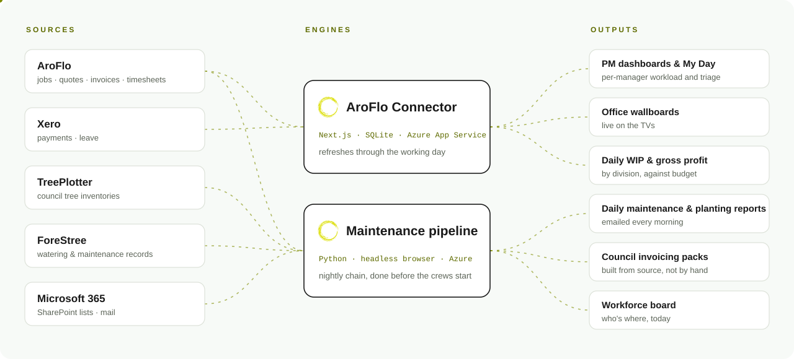

<picture>
  <source media="(prefers-color-scheme: dark)" srcset="assets/banner-dark.svg">
  
</picture>

 

Field crews do the work. This org holds the software that keeps score: it reads the job, finance and council systems we already use and turns them into dashboards, wallboards, daily reports and invoicing packs, so the office spends less time copying numbers between them.

### What we've built

<picture>
  <source media="(prefers-color-scheme: dark)" srcset="assets/system-map-dark.svg">
  
</picture>

### Repositories

| Repository | What it does | Runs on |
|---|---|---|
| [**aroflo-connector**](https://github.com/blended-services/aroflo-connector) | Reporting over the AroFlo API and Xero: per-PM workload, gross profit by division, daily WIP, triage, and the office wallboards. | Next.js · SQLite · Azure App Service |
| [**bsg-maintenance-automation**](https://github.com/blended-services/bsg-maintenance-automation) | Pulls council tree records overnight, builds the maintenance master, sends the daily maintenance and planting reports, and prepares council invoicing. | Python · Node · Azure Container Apps jobs |

### How we work

- **Melbourne time, always.** Every date a person sees is AEST/AEDT.
- **The financial year runs July to June.** Reporting windows, budgets and forecasts are built around it.
- **Business rules live next to the code.** Most of them can't be guessed from the schema, so they're written down where the next change will trip over them.
- **Non-obvious rules get a probe.** If a rule matters, a script proves it against real data before anyone relies on it.

### Access

Repositories here are private. If you need access, talk to Jordan.
